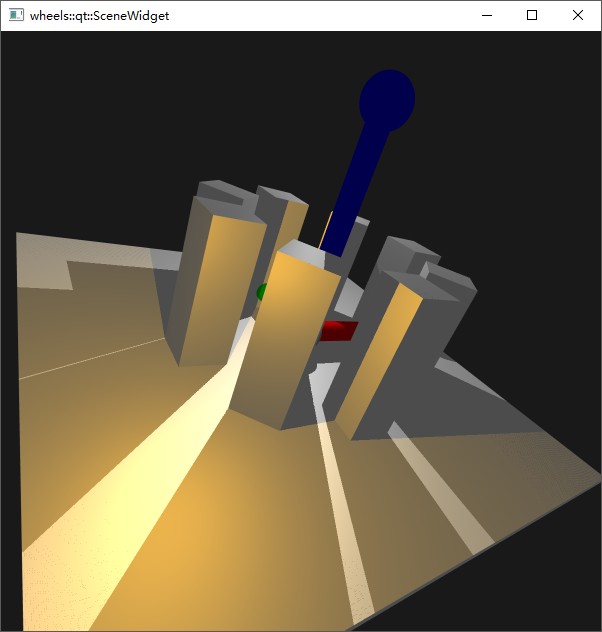
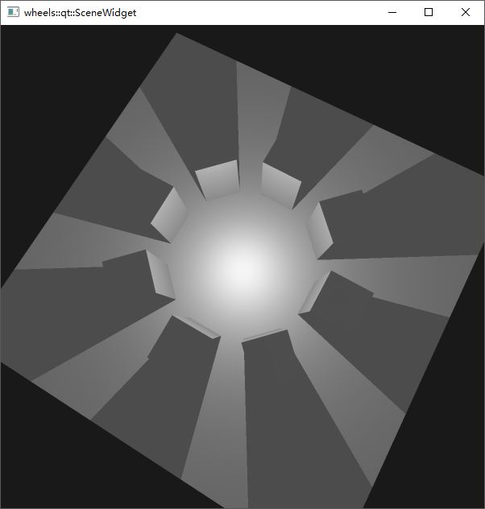

# Wheels.UI

The UI module for 3D visualization in wheels.
[WheelsPlatform](https://github.com/YANG-H/WheelsPlatform) is required for building this project.

## Features 
1. Multiple lights shadowing;
2. Automatic discretization of common shapes;
3. ...

## Samples
Write these code:
```cpp
  qt::SceneWidget sw([](scene &s) {
    s.add_light(point_light<float>{vec3f(3, 5, 8), color::white});
    s.add_light(point_light<float>{vec3f(-7, -5, 4), color::orange});
    s.add_light(point_light<float>{vec3f(0, 0, -5), color::white});

    s.add_material("white", color::white);
    s.add_material("light gray", color::light_gray);

    s.add_material("red", color::red);
    s.add_material("green", color::green);
    s.add_material("blue", color::blue);

    s.add_geometry("plate",
                   make_box(vec3f(-11, -11, -1.3), vec3f(11, 11, -1.0)));
    s.add_geometry("box", make_box(vec3f(-1, -1, -1), vec3f(1, 1, 1)));

    s.add_geometry(
        "xbar",
        make_cylinder_along(make_line(vec3f(0, 0, 0), vec3f(10, 0, 0)), 0.5f));
    s.add_geometry(
        "ybar",
        make_cylinder_along(make_line(vec3f(0, 0, 0), vec3f(0, 10, 0)), 0.5f));
    s.add_geometry(
        "zbar",
        make_cylinder_along(make_line(vec3f(0, 0, 0), vec3f(0, 0, 10)), 0.5f));

    s.add_geometry("ball", sphere<vec3f, float>{vec3f(), 1.0f});

    s.add_object("x", "xbar", "red");
    s.add_object("y", "ybar", "green");
    s.add_object("z", "zbar", "blue");
    s.add_object("o", "ball", "light gray");

    s.add_object("plate", "plate", "white");

    s.add_object("ox", "ball", "red",
                 make_transform().translate(vec3f(10, 0, 0)).matrix());
    s.add_object("oy", "ball", "green",
                 make_transform().translate(vec3f(0, 10, 0)).matrix());
    s.add_object("oz", "ball", "blue",
                 make_transform().translate(vec3f(0, 0, 10)).matrix());

    const int N = 8;
    for (int i = 0; i < N; i++) {
      s.add_object(
          "box_" + std::to_string(i), "box", "white",
          make_transform()
              .translate(vec3f(5, 0, 0))
              .rotate((float)numeric::PI * 2.0f * i / N, vec3f(0, 0, 1))
              .scale(vec3f(1, 1, 5))
              .matrix());
    }
  });
  sw.show();
```
And get the results!




